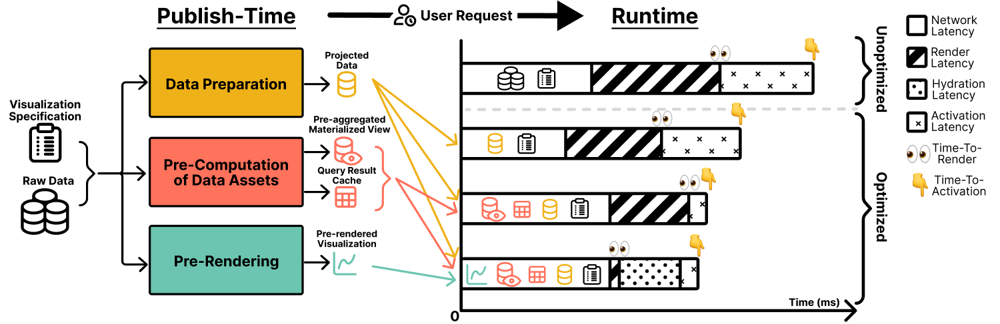
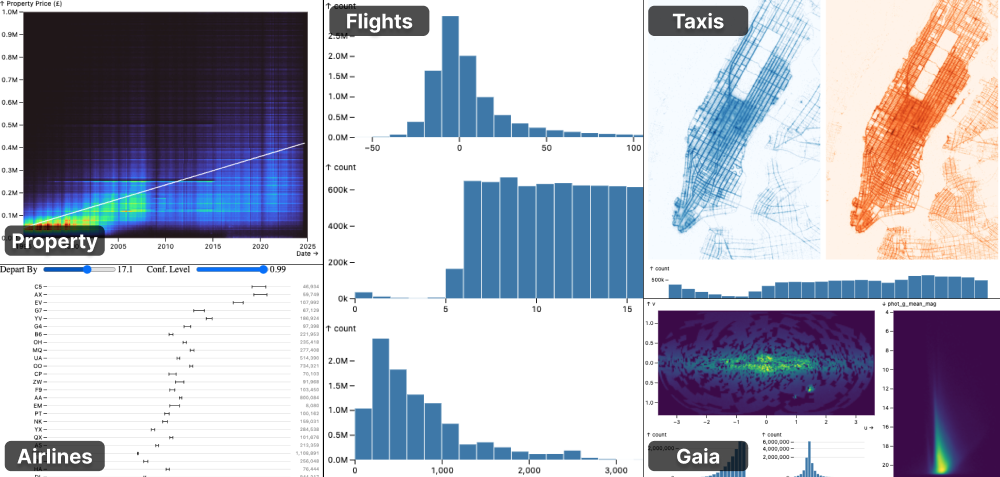
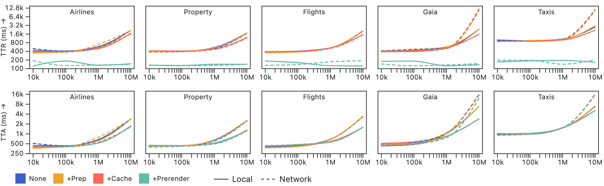
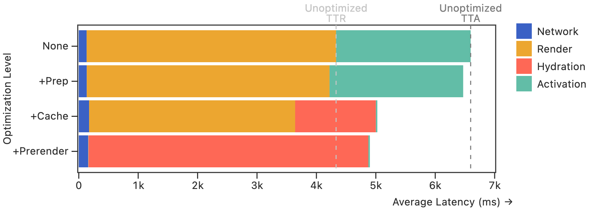

<!--
  Core Contributions:
  1. Characterization of Publish-Time Optimization Strategies
     - Categorization of the types of optimizations possible at publication time for large-scale visualization dashboards.
     - Taxonomy for identifying trade-offs (latency improvements vs. storage costs) aka TTFR vs. TTFI etc.
  2. Integration and Implementation in Mosaic
      - Extensions to Mosaic's architecture to support publish-time precomputation and bundling + Specific implementation details within existing system.
  3. Evaluation of Performance Gains
     - Quantified comparisons to a variety of non-optimized scenarios of TTFR, TTFI, storage cost, etc (?).
 -->
::: teaser {#overview}
\vspace{-6pt}

| Overview of publish-time optimization strategies for interactive visualizations. Shifting data preparation, optimization computations, and rendering to publish time improves both time-to-render (TTR) and time-to-activation (TTA).
\vspace{-4pt}
:::

::: abstract
Fast loading and responsive interaction lead to more effective web-based visualizations.
While run-time optimizations such as caching and data tiling improve interaction latency, these approaches leave initial load performance unoptimized.
In this work, we investigate _publish-time optimizations_ that shift computational work ahead of user sessions to accelerate both loading and interaction.
We organize the space of publish-time optimizations into categories of data preparation, pre-computation of data assets for optimization, and pre-rendering; and then reason about tradeoffs in terms of time-to-render (TTR), time-to-activation (TTA), and storage cost (SC).
To assess their effectiveness, we implement publish-time optimizations for the open-source Mosaic architecture and evaluate their impact across varied visualizations and dataset sizes.
On average, publish-time strategies reduced rendering latency by 83.7% and activation latency by 33.3%, demonstrating their value for improving the performance of web-based visualizations.
:::

<!-- ::: acknowledgments
TODO
::: -->

# Introduction {#intro}

Maintaining low latency in interactive visualizations is essential for supporting analysis and engagement; however, providing responsive performance in web-based visualization systems remains difficult [@doi:10.1109/TVCG.2020.3028891; @doi:10.1145/3639276].
Even small delays can interrupt cognitive flow, reducing user engagement and insight generation [@doi:10.1145/2133806.2133821; @doi:10.1109/TVCG.2014.2346452; @doi:10.1037/1076-898X.6.4.322].
Prior work [@doi:10.1109/VIS54862.2022.00011; @doi:10.1145/3639276; @doi:10.1109/TVCG.2013.179; @doi:10.1145/3290605.3300924; @doi:10.1111/cgf.12129; @doi:10.14778/3407790.3407826; @doi:10.1109/TVCG.2023.3327189] has improved interaction latency using optimizations such as caching, prefetching, indexing, and pre-aggregation.
These techniques may involve run-time or publish-time computation, but have not directly addressed initial rendering latency.

_Publish-time optimizations_ shift computational work from run-time to deployment time.
In so doing, they can reduce both initial load and interaction latency, while enabling reuse of precomputed assets across multiple user sessions.
In web development, publish-time optimizations such as server-side rendering (SSR) are popular for reducing page load latency [@doi:10.46430/phen0048; @doi:10.34218/ijrcait_08_01_059; @doi:10.48550/arXiv.2412.07892].
Drawing inspiration from these techniques, we explore publish-time optimizations for interactive visualization such as data preparation, pre-computation of data assets for optimization, and pre-rendering.
To characterize the space of publish-time optimization techniques for data visualization, we focus on three key metrics: *time-to-render (TTR)* (the time until visualization content becomes visible), *time-to-activation (TTA)* (the time until the system is ready to respond to user input), and *storage cost (SC)* (the size of all deployed assets).

We implement publish-time optimizations in the open-source Mosaic architecture [@doi:10.1109/TVCG.2023.3327189], and analyze trade-offs between the three metrics across different optimizations, dataset sizes, and visualizations.
Our evaluation shows significant improvements in both initial rendering and interaction latencies across multiple dashboard types and dataset sizes, with average reductions of 83.7% and 33.3%, respectively ([@tbl:breakdown-raw]).
Our methods and evaluation results provide visualization developers with strategies and guidance to address the persistent challenge of visualization performance.

# Related Work {#related}

Our work builds upon research in latency perception, scalable visualization, and publish-time strategies in web development.

## Latency in Interactive Visualizations

HCI research highlights the importance of minimizing interface latency. Delays over 100ms can disrupt cognitive flow, as even small latencies affect user interaction strategies [@doi:10.1145/2133806.2133821; @doi:10.1145/634067.634255; @doi:10.1037/1076-898X.6.4.322].
In the context of exploratory visual analysis, Liu and Heer [@doi:10.1109/TVCG.2014.2346452] show that interaction delays above 500ms lead to significantly fewer interactions, slower task completion, and reduced insight generation.
Similar work in web development echoes these concerns, showing that load and interaction latencies as small as 100ms can lead to a 1% sales loss for Amazon and a 250ms decrease in latency is considered a competitive advantage [@doi:10.1145/2670518.2673876].
Furthermore, in a web context latency has been shown to directly affect user attitude and behavior [@doi:10.17705/1jais.00044; @doi:10.1145/332040.332447], highlighting its importance.
As a whole, these findings underscore the need for optimizations that target interaction latency *and* load times (TTR, TTA), as all can impact analysis outcomes.

## Optimizations in Scalable Visualization Systems

Some visualization systems employ optimizations to reduce interactive latency.
For example, pre-aggregation via data cubes [@doi:10.1109/icde.1996.492099; @doi:10.1145/235968.233333] enables low-latency brushing and linking in systems such as imMens [@doi:10.1111/cgf.12129], Nanocubes [@doi:10.1109/TVCG.2013.179], Hashedcubes [@doi:10.1109/TVCG.2016.2598624], Falcon [@doi:10.1145/3290605.3300924] and Mosaic [@doi:10.1109/TVCG.2023.3327189].
Prefetching can also improve responsiveness.
ForeCache [@doi:10.1145/2882903.2882919] predicts user actions to load relevant data tiles, while Khameleon [@doi:10.14778/3407790.3407826] hedges across many possible requests using cost-benefit modeling to determine when and which tiles to load.
Meanwhile, VegaFusion [@doi:10.1109/VIS54862.2022.00011] and VegaPlus [@doi:10.1145/3514221.3520168] optimize run-time performance by offloading computation to a database server.

For ad-hoc analysis by a dedicated data team, "cold start" performance with no preparation delay is advantageous.
Some of the systems above can apply optimizations "on-the-fly" at run-time [@doi:10.1145/3290605.3300924; @doi:10.1109/TVCG.2023.3327189].
Others, such as Nanocubes [@doi:10.1111/cgf.13708] and Kyrix [@doi:10.1109/TVCG.2020.3030372], can require lengthy index precomputation.
For many web-based dashboards with varied audiences, a publishing delay is acceptable, providing an opportunity for further optimization.
We focus on using publish-time optimizations to improve the downstream user experience.

## Web Publish-Time Optimizations

The web development community has long embraced publish-time strategies to improve perceived performance, particularly for reducing initial load latency (TTR). Static Site Generation (SSG) pre-renders pages at build time into HTML, CSS, and JavaScript, enabling rapid loading from content delivery network caches [@doi:10.46430/phen0048; @doi:10.1145/3477314.3506991].
For dynamic content, Server-Side Rendering (SSR) generates HTML on-demand per request, often paired with "hydration" to attach interactive client-side behavior [@doi:10.54554/jtec.2022.14.04.005; @doi:10.34218/ijrcait_08_01_059]. Modern web frameworks use SSR to improve "first contentful paint" (FCP), while balancing the cost of request-time rendering [@doi:10.7753/ijcatr1210.1004]. Enhancements like progressive hydration and streaming SSR reduce Time to Interactive (TTI) further by incrementally activating page components [@doi:10.21275/sr24054120639].

<!-- Incremental Static Regeneration (ISR) offers a hybrid model: it generates static pages at build time but allows for per-page regeneration after deployment, either periodically or on-demand [@doi:10.21275/sr24054120639]. This achieves low TTFR without sacrificing content freshness, and is supported by empirical work comparing ISR against CSR and SSR in frameworks like Next.js [@doi:10.24843/jlk.2023.v12.i02.p20]. -->

<!-- Recent surveys on web performance also identify complementary publish-time techniques such as code splitting, tree shaking, image optimization, and minification---all of which reduce bundle size and defer computation to improve interactivity [@doi:10.48550/arXiv.2412.07892; @doi:10.58175/gjarr.2024.2.1.0032; @doi:10.1007/978-1-4842-6528-4]. Empirical benchmarks show frameworks with publish-time optimizations like Svelte or Astro often outperform traditional virtual DOM frameworks in both initial load and runtime responsiveness [@doi:10.13052/jwe1540-9589.21311]. -->

While these strategies are common to modern web apps, their systematic application to interactive visualization remains limited.
Visualization systems offer new opportunities for publish-time optimizations; unlike general websites they often involve static specifications, patterned queries, and predictable user interactions, making them strong candidates for precomputation.
We seek to bridge this gap by characterizing publish-time optimizations for interactive visualizations and evaluating their performance impacts.

# Publish-Time Optimization Strategies {#characterization}

The structured nature of interactive visualizations and the regularity of user interaction patterns create natural opportunities for shifting work from run-time to publish-time.
By leveraging these characteristics, visualization systems can precompute costly computations improving visualization responsiveness.
We group publish-time optimization strategies into three primary categories:
\vspace{-6pt}

1. **Data Preparation and Projection**: Transform and reduce data to minimize query costs and the size of input data. \vspace{-6pt}
2. **Pre-computation of Data Assets for Optimization**: Materialize common query results ahead of time and build pre-aggregated materialized views for interaction queries. \vspace{-6pt}
3. **Pre-rendering of Visual Outputs**: Render visualization states in advance (e.g., as vector or bitmap graphics). \vspace{-6pt}

These categories introduce trade-offs among performance gains, storage/network overhead, and data freshness.
The effectiveness of each strategy can vary significantly (@sec:evaluation) based on the context in which it is being applied, as the trade-offs are conditioned on the characteristics of the visualization(s) being optimized, such as dataset size or the number and type of linked views.
For example, initial pre-rendering improves TTR in all cases, whereas data preparation benefits cases where significant transformation or data reduction can be applied up front.
Ultimately, the choice of optimization strategy should be guided by a careful consideration of these factors alongside current goals and constraints.

## Optimization Goals and Metrics {#metrics}
Publish-time optimizations aim to minimize user-perceived latencies without excessive resource costs (or vice versa). We quantify these goals using three key metrics:
\vspace{-6pt}

- **Time-to-Render (TTR)**: Time from page request to visual content becoming visible. Akin to FCP in web performance, TTR measures when meaningful content appears onscreen, and can affect engagement [@Brutlag2009-du]. Unlike FCP, TTR specifically measures when the full visualization (not just any page content) is visible, reflecting when analysis can begin. \vspace{-6pt}
- **Time-to-Activation (TTA)**: Time until the system is ready to respond to user input (e.g., filtering, zooming, selection). Similar to TTI in web development, TTA measures when page content becomes responsive. \vspace{-6pt}
- **Storage Cost (SC)**: The size of precomputed assets, including impact on deployment footprint, network transfer times, and client memory consumption. \vspace{-6pt}

Beyond these metrics, secondary considerations such as data freshness (how quickly visualizations reflect source data updates) drive optimization decisions. Optimization strategies may need to balance competing objectives for a given application.

## Data Preparation and Projection
Data preparation transforms raw input data into forms that are faster to load and query at runtime, reducing both TTR and TTA without altering the visualized content. These concerns include:
\vspace{-6pt}

- **Column Projection**: Select only the columns needed for visualization, reducing transfer size and memory load. \vspace{-6pt}
- **Transformation**: Published visualizations may involve preparatory transformations, such as derived field calculations, multi-table joins, and cartographic projection. Such transformations may be performed at publish time. \vspace{-6pt}
- **Data Layout**: Given known access paths (such as common filtering values), data might be sorted or partitioned for faster interactive query performance. \vspace{-6pt}

Reducing data volume (SC) is a simple way to improve both TTR and TTA. However, depending on the amount of preparatory transformation involved, the differences may be small and lead to stale data, as updates to the source data require (eventual) regeneration of the prepared assets.
This trade-off makes data preparation most effective for datasets that are static or for which a periodic update schedule is feasible.
For highly dynamic datasets, the cost and delay of (re-)prepared assets may outweigh the benefits.

## Pre-computation of Data Assets for Optimization

Many scalable visualization methods involve building acceleration structures, including data tiles, indexes, and pre-aggregated views.
For example, pre-aggregated materialized views in Falcon [@doi:10.1145/3290605.3300924] and Mosaic [@doi:10.1109/TVCG.2023.3327189] group data by both bins and interactive pixels (e.g., capturing possible brush positions) to dramatically improve latency of interactive filtering and re-aggregation.
Given knowledge of the possible interactive selections, such pre-aggregations can be pre-computed for the initial visualization state, avoiding potentially costly [@doi:10.1109/TVCG.2023.3327189] construction queries at run-time.
Pre-computed assets may be transferred at load time, trading construction latency for network latency.
A similar approach applies to other acceleration structures such as query caches and indexes.

These optimizations can significantly improve TTA when load time is less than construction time.
For pre-aggregation and related tiling methods, the impact on SC scales with the number of aggregation dimensions and resolution levels, as the number of assets can grow combinatorially across multi-view interactions.
Overly aggressive pre-computation may yield high storage overhead with limited benefit if pre-computed assets remain unused.
These diminishing returns suggest that pre-aggregation will be best applied when interaction spaces are constrained or when applied selectively to the most commonly used and/or latency sensitive interactions.

## Pre-rendering Visual Output

Pre-rendering draws on web optimization techniques such as SSG or SSR, and involves generating static or semi-static visual outputs (SVG elements, raster images, etc) at publish time. This strategy targets TTR by reducing or eliminating the need for runtime data loading and rendering. Pre-rendering can take several forms:
\vspace{-6pt}

- **Initial Pre-rendering**: Only the initial state is pre-rendered. Dynamic content is attached at runtime via **hydration** to bind interactive logic to pre-rendered views. \vspace{-6pt}
- **Total Pre-rendering**: All visualizations and all interaction states are pre-rendered. This is practical for visualizations with limited to no interaction and without frequent data updates. \vspace{-6pt}
- **Mixed Pre-rendering**: A subset of selected interactions are prerendered (e.g., all options in a small menu). This is practical when the space of possible states is limited and known. \vspace{-6pt}

Pre-rendering directly reduces TTR, but can come with downstream costs associated with data hydration.
Depending on the level of the pre-rendering, it can lead to significant increases in SC.
While all configurations can benefit from initial pre-rendering, more aggressive pre-rendering that includes interaction states is only suitable if the number of interaction states is tightly bounded.
However, in such cases, a system might not need to send any backing data.

## Summary

The above optimizations can be combined to improve the performance of published visualizations.
In addition, they amortize computation costs across multiple user sessions, producing reusable assets and increasing overall efficiency by reducing redundant computation by every web client.
By characterizing these strategies, we provide guidance for selecting publish-time optimizations that align with a publisher's latency goals and deployment constraints.

<!--
### Example
  - Use example from Mosaic gallery that benefits from most (but not all) of the optimizations
    - Protein Design?
    - Gaia Star?
    - NYC Taxi?
    - Olympics Athletes?
  - Demonstrate without code why the optimizations are relevant and how they can help
    - Frame visualizations that were previously discussed in the context of this example
  - Include visualization of pre-rendered -> real interactable visualization
  - End this section by discussing reusability
-->

# Implementation in Mosaic {#implementation}

We implement publish-time optimizations in the Mosaic architecture [@doi:10.1109/TVCG.2023.3327189], atop declarative specifications of interactive visualizations.
Mosaic's architecture decouples specification logic from data processing by managing query execution through a central coordinator, and provides reactive primitives for linking interactions.
This design enables publish-time optimizations to be applied either transparently (by pre-populating cache and database content) or via simple, targeted specification rewrites that reference precomputed assets.

## System Overview

Mosaic visualizations can be defined using data, view, and interaction specifications written in a declarative syntax.
Our publish-time optimizations focus on YAML-based specifications, which are parsed into an abstract syntax tree (AST).
The AST enables static analysis and specification rewriting to reference precomputed assets.

Mosaic uses a central _coordinator_, which manages query execution across multiple clients, typically backed by a DuckDB [@doi:10.1145/3299869.3320212] database.
Query execution can occur locally in the browser (via DuckDB-WASM), on a local server, or on a remote database.
This flexibility is key to supporting publish-time workflows, as precomputed assets can be generated independently of run-time execution environments using an in-process DuckDB instance.

## Specification Optimization and Rewriting

We developed **Mosaic Publisher**, a utility that analyzes visualization specifications, simulates interactions, and rewrites data definitions to reference precomputed assets.
Specification rewrites occur automatically based on a user-selected optimization level, incrementally applying *data preparation and projection*, *aggregate and cache pre-computation*, and *visualization pre-rendering*.
This design allows visualization designers to benefit from publish-time optimizations while retaining their original specifications.

The publisher performs the following steps.
**Interaction Simulation**: Programmatically activate interactors and inputs on a virtual DOM to trigger all queries that could be issued during runtime interaction.
**Query Materialization**: Execute data preparation, initial loading, and pre-aggregation queries and save the results as deployable assets.
**AST Rewriting**: Replace data preparation queries in a specification with references to precomputed results.
**Hydration Support**: Emit JavaScript code to populate the Mosaic cache and database with pre-computed assets. For pre-rendered views, generate additional logic to initialize interactive components at runtime.

## Challenges and Design Considerations

**Interaction Pattern Discovery.**
A core challenge in publish-time optimization for interactive visualizations is that queries are generated in response to user inputs. Mosaic Publisher addresses this by simulating interaction events during the publish process to ensure that all relevant queries (those that would normally be triggered by filtering, selection, or brushing) are exercised and materialized.

**Transparent vs. Explicit Optimization.**
In Mosaic, many optimizations can be applied transparently because of the coordinator's control over query generation and execution.
For example, the coordinator's query cache, which stores the results of previously executed queries, can be pre-populated with initialization queries at publish time and loaded alongside the visualization.
Similarly, pre-aggregated materialized views can be pre-computed and loaded into the database upon initialization. The Mosaic coordinator will then automatically use these assets rather than re-compute them.
However, when optimizations fundamentally alter data access patterns (i.e., replacing preparation queries with precomputed data), the publisher explicitly rewrites the specification.

**Balancing Pre-rendering and Interactivity.**
Pre-rendering reduces initial load times (TTR) but requires hydration steps to enable interactivity (TTA).
Mosaic Publisher detects whether a visualization includes active interactors or inputs.
For non-interactive views, it emits only pre-rendered web content with no additional runtime logic, reducing both JavaScript and data payloads.
For interactive views, it outputs pre-rendered initial states alongside JavaScript code to hydrate the visualizations and enable runtime interactions.
Our current hydration approach simply instantiates interactive components through the standard client-side rendering process; we leave more nuanced hydration methods to future work.

By leveraging Mosaic's declarative specifications, coordination mechanisms, and centralized query management, our implementation enables publish-time optimizations to be integrated seamlessly, rewriting specifications where necessary, while preserving the expressiveness and flexibility of the Mosaic system.
The Mosaic Publisher implementation is available at _anonymized URL_.

::: figure {#collage}

| Visualizations used to evaluate publish-time optimizations.
:::

# Evaluation {#evaluation}

::: figure {#optimizations}

| Time-to-Render (TTR, top) and Time-to-Activation (TTA, bottom) across specifications, dataset sizes, and optimizations. Lines show median times in milliseconds, while shaded areas indicate interquartile ranges.
\vspace{-12pt}
:::

We evaluate the performance impact of the Mosaic Publisher across five visualization specifications (@fig:collage) selected to represent a diverse range of interaction styles, view configurations, and query complexities. These include: **airlines**, a single-view chart with a filter slider and confidence interval overlays; **property**, a raster density plot with interactive regression fits; **flights**, a basic cross-filtering example with linked histograms; **gaia** and **taxis**, complex multi-view dashboards with high-resolution rasters and multiple coordinated selections. (Both the flights and gaia example are taken from the original Mosaic paper [@doi:10.1109/TVCG.2023.3327189].) These examples cover both low and high cardinality selections, different types of interval filtering, and visualization types that stress different optimization paths.

::: table {#raw-data}
| Optimization | TTR (ms)         | TTA (ms)          | Storage (MB)     | Publish Time (ms)   |
|--------------|-----------------:|------------------:|-----------------:|--------------------:|
| none         |      989 \pm 257 |     1640 \pm 656 |     31.3 \pm 20.3 |        3090 \pm 907 |
| minimal      |      986 \pm 275 |     1637 \pm 688 |     31.3 \pm 20.3 |        3051 \pm 930 |
| more         |      826 \pm 221 |     1132 \pm 567 |     42.6 \pm 34.8 |        3123 \pm 950 |
| most         |      156 \pm 15  |     1114 \pm 565 |     42.6 \pm 34.9 |        3113 \pm 960 |

| Average TTR, TTA, Storage Cost, and Publishing Time ($\pm \sigma$) across visualizations and dataset sizes.
\vspace{-10pt}
:::

To assess the effects of each optimization category (@sec:characterization), we apply them incrementally: **none** performs all computation at runtime, **+prep** applies data preparation and projection rewrites, **+cache** further precomputes and stores both result caches and materialized aggregates for interaction updates, and **+prerender** adds initial pre-rendered visual outputs with hydration to enable interactivity.
All benchmarks were run within Node.js v22.9.0 on a 2021 MacBook Pro laptop (14-inch, macOS 15.2) with an M1 Pro processor and 16GB RAM. The visualizations were hosted on a local server with DuckDB-WASM used as the backing database engine.

@fig:optimizations confirms that without publish-time optimization, both TTR and TTA scale poorly with increasing data size---especially beyond one million rows---due to runtime query execution and rendering.
Preparation alone (+prep) did not help the tested visualizations as they don't involve preparatory transformation and don't have extraneous columns; however, it is expected to provide more benefit for visualizations that operate over wide tables with many unvisualized columns or have non-trivial preparation queries.
Precomputing caches and aggregates (+cache) significantly reduces TTA, especially for datasets with 1M or more rows, enabling the system to respond more quickly to selection interactions.
However, for smaller dataset sizes these assets can be computed quickly on-the-fly and optimization is not necessary.
Pre-rendering (+prerender) consistently achieves the lowest TTR across all visualizations and dataset sizes, as rendering is performed entirely at publish time and loaded as static output (@fig:breakdown).

::: figure {#breakdown}
\vspace{12pt}

| Breakdown of latency components averaged across visualization specifications with a backing dataset of 10 million rows.
<!-- \vspace{-18pt} -->
:::

::: table {#breakdown-raw}
| Optimization | \Delta SC (%)     | \Delta TTR (%) | \Delta TTA (%) |
|--------------|------------------:|---------------:|---------------:|
| +prep        |       0.0 \pm 0.0 |   -0.6 \pm 4.0 |   -1.0 \pm 2.5 |
| +cache       |     21.1 \pm 29.8 |  -16.6 \pm 1.3 |  -32.3 \pm 8.9 |
| +most        |     21.2 \pm 29.9 |  -83.7 \pm 2.1 |  -33.3 \pm 9.6 |

| Average percentage change ($\pm \sigma$) of metrics across visualizations and dataset sizes relative to no optimizations.
\vspace{-10pt}
:::

@fig:breakdown further shows that despite removing runtime render cost, pre-rendering still incurs a hydration cost that is nearly equivalent to a full client-side render.
Future work might explore finer-grained hydration or schemes to reduce this overhead.
Browser loading and network transfer time remains a stable portion of total latency, with any differences being minor compared to the respective latency improvements, showing that the effect of storage cost in these examples was negligible.
@tbl:breakdown-raw summarizes these effects numerically.
Across specifications, dataset sizes, and optimizations, the average publishing time is only 1455.3ms $\pm$ 1779.0ms longer than the corresponding unoptimized TTA, making it a reasonable one-time cost.
Overall, these results demonstrate that publish-time strategies can yield substantial performance improvements to TTR and TTA across interaction and visualization types.

# Conclusion {#conclusion}

In this paper, we characterize and evaluate publish-time optimization strategies for interactive visualization systems, offering a complementary approach to run-time optimizations.
Using a framework centered on three key metrics (time-to-render, time-to-activation, and storage cost), we then can reason about the trade-offs inherent to these optimizations.
We integrate these strategies into the Mosaic architecture, demonstrating their feasibility in real-world systems and enabling substantial latency reductions through data preparation, pre-computation of data assets for optimization, and pre-rendering.

<!-- We also highlight the challenges associated with more dynamic or open-ended visualization scenarios. -->

Our findings suggest untapped potential for publish-time optimizations, especially for visualizations with stable data and predictable interaction patterns.
Future work might look at expanding the space of optimizations, drawing further inspiration from web applications by exploring options such as hybrid publish/runtime strategies or incremental regeneration.
Another avenue for future work is to develop methods for automatically selecting effective optimization configurations based on input data and visualization specifications.
By characterizing and demonstrating these techniques, we hope to inspire further adoption of publish-time approaches in visualization system design, improving responsiveness and scalability for widely-deployed visualization applications.

~~~ bibliography
@article{Brutlag2009-du,
  title     = "Speed matters for Google web search",
  author    = "Brutlag, J",
  journal   = "Google. June",
  publisher = "venturebeat.com",
  year      =  2009
}
~~~